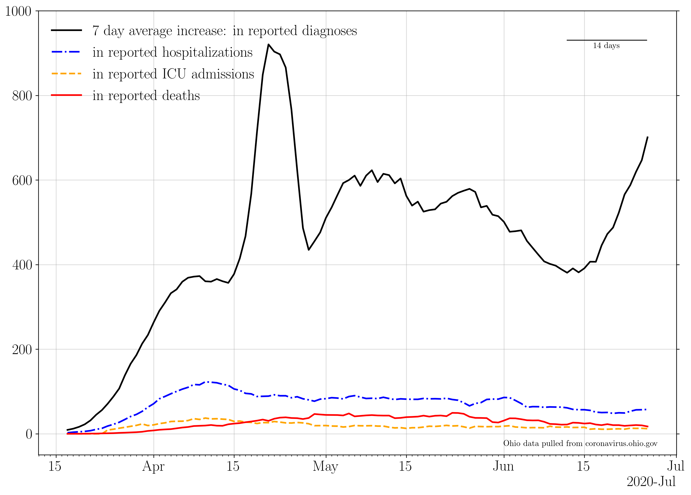

## Plotting publicly available COVID data for the state of Ohio.

The 7 day averages for the daily increase in cases, hospitalizations, ICU admissions, and deaths.

If no new cases were reported, this line would go to zero.

The 7 day averages for the daily increase in hospitalizations, ICU admissions, and deaths.

If no new events were reported, these lines would go to zero.

