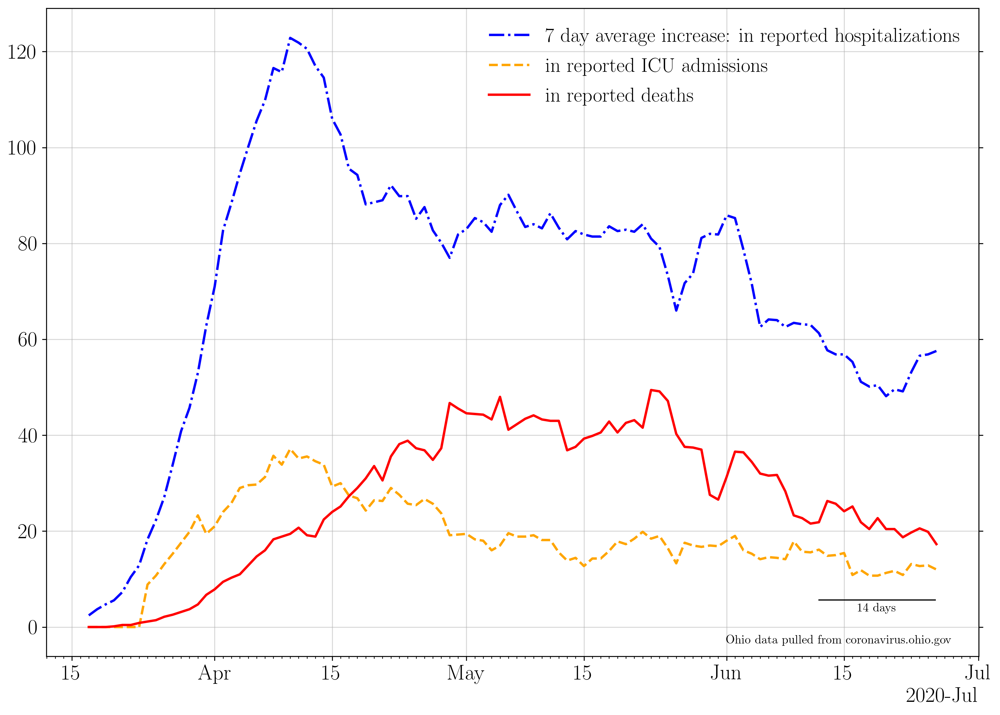
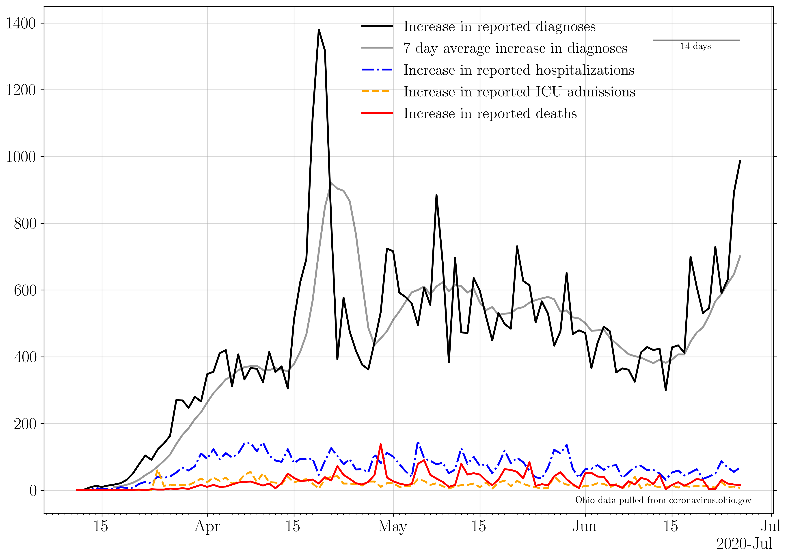
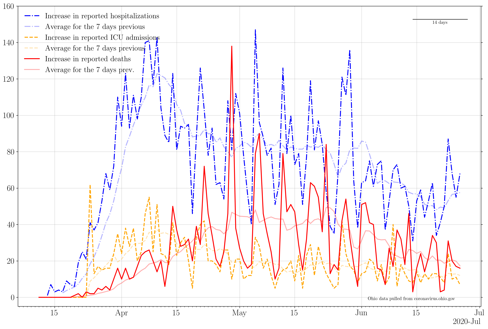
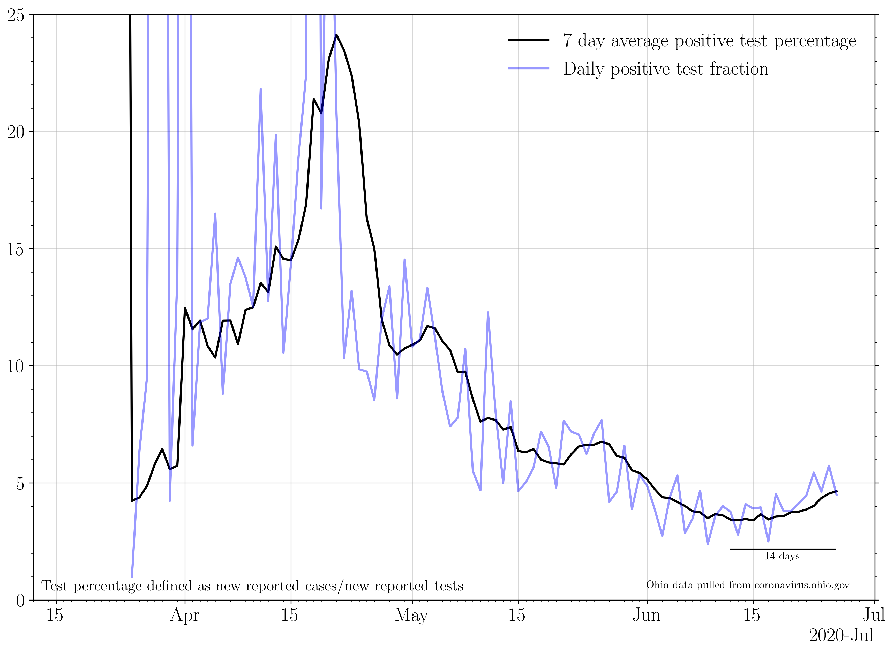
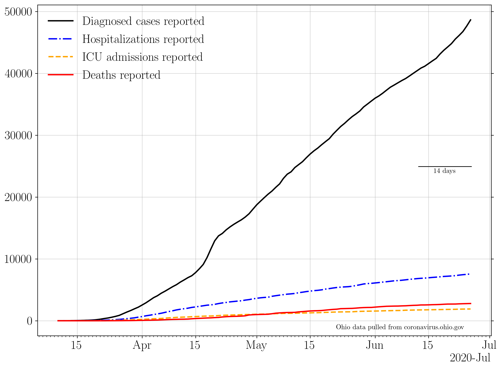
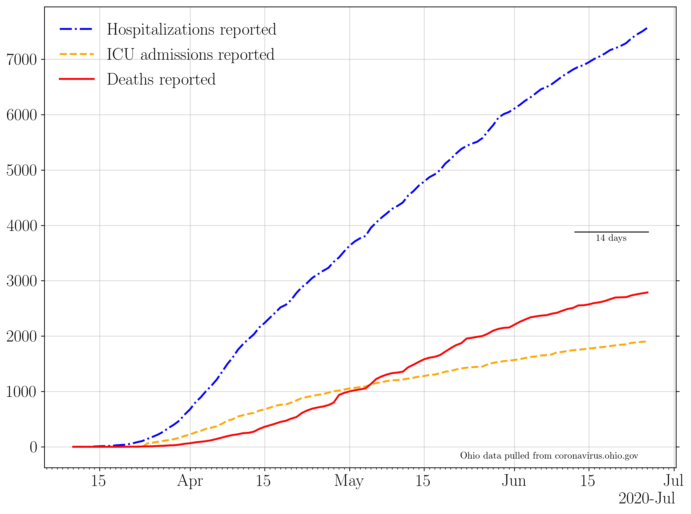

## Plotting publicly available COVID data for the state of Ohio.

### 7 day averages
The 7 day averages for the daily increase in cases, hospitalizations, ICU admissions, and deaths.

If no new cases were reported, this line would go to zero.

The 7 day averages for the daily increase in hospitalizations, ICU admissions, and deaths.

If no new events were reported, these lines would go to zero.

### Raw data
The raw daily increase in cases, hospitalizations, ICU admissions, and deaths. The 7 day average is shown faintly behind the raw data.

If no new cases were reported, this line would go to zero.

The raw daily increase in hospitalizations, ICU admissions, and deaths. The 7 day average is shown faintly behind the raw data.

If no new events were reported, these lines would go to zero.

### Testing

The increase in the number of reported total tests (blue). A 7 day running average is shown in black.

The percent of each day's new reported tests which represent that day's new reported cases.

### Cumulative plots

The cumulative number of cases, hospitalizations, ICU admissions, and deaths.

If no new cases were reported, these line would be horizontal.

The raw daily increase in hospitalizations, ICU admissions, and deaths. The 7 day average is shown faintly behind the raw data.

If no new events were reported, these lines would be horizontal.
