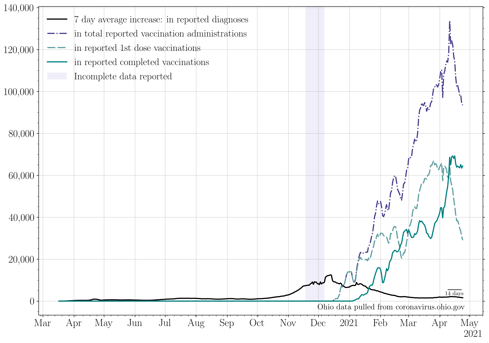
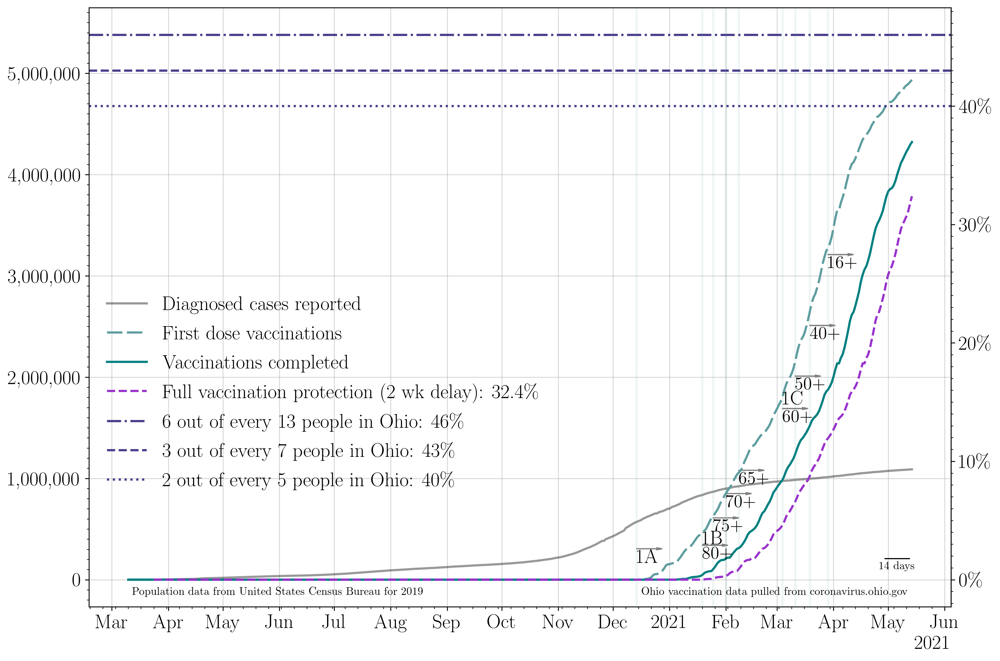

## Plotting publicly available COVID data for the state of Ohio. 

Last updated: Jan 14 2021. 

**Dec 8th completes a backlog of reporting of antigen test results, dating back to Nov 1st.**

**No data was reported on Nov 26th (Thanksgiving), Dec 25th (Christmas), or Jan 1st (New Year's).**
### 7 day averages
The 7 day averages for the daily increase in cases, hospitalizations, ICU admissions, and deaths. If no new cases were reported, these lines would go to zero.

>The average increase in cases for the last seven days is: 7746.0
>
>The last time cases per day were this high was Jan 13 2021: 1 day ago.
>
>The seven day average then was: 8117 cases.

>
>The last time cases per day was lower than this was Jan 07 2021: 7 days ago.
>
>The seven day average then was: 7527 cases.
>
>The lowest 7 day average reported cases per day in the last three weeks was on Dec 29 2020.
>
>This was 16 days ago. The average was 6505 cases per day.
>
>The current 7 day average case rate is an increase of 19.1 percent with respect to that minimum.

The 7 day averages for the daily increase in hospitalizations, ICU admissions, and deaths. If no new events were reported, these lines would go to zero.

>The average increase in hospitalizations per day for the last seven days is: 289
>
>The lowest 7 day average reported hospitalizations per day in the last three weeks was on Dec 26 2020.
>
>This was 19 days ago. The average was 280 hospitalizations per day.
>
>The current 7 day average hospitalization rate is an increase of 3.2 percent with respect to then.

The 7 day average increase in cases, compared to the number of first round vaccinations dispensed:

### Raw data
The raw daily increase in cases, hospitalizations, ICU admissions, and deaths. The 7 day average is shown faintly behind the raw data. If no new cases were reported, this line would go to zero.

>The increase in cases from yesterday to today: 7654.0 
>
>The last time cases per day were this high was Jan 12 2021: 2 days ago. 
>
>The case rate then was 7981 cases.
>
>The last time cases per day were lower than this was Jan 13 2021: 1 day ago. 
>
>The case rate then was 6701 cases.

The raw daily increase in hospitalizations, ICU admissions, and deaths. The 7 day average is shown faintly behind the raw data. If no new events were reported, these lines would go to zero.

### Testing

The increase in the number of reported total tests (navy). A 7 day running average is shown in black.

The percent of each day's new reported tests which represent that day's new reported cases.

>The lowest 7 day average reported positive test fraction per day in the last three weeks was on Dec 28 2020.
>
>This was 17 days ago. The average was 15.1 percent positive. 
>
>The current average positive test rate is 15.9 percent, a change of 5.3 percent with respect to then. 

### Cumulative plots
The cumulative number of cases, hospitalizations, ICU admissions, and deaths. If no new cases were reported, these lines would be horizontal.

>The current total number of cases is equivalent to 1 person out of every 14 people in the state of Ohio having tested positive for COVID-19.

The cumulative number of hospitalizations, ICU admissions, and deaths. If no new events were reported, these lines would be horizontal.

The cumulative number of first round vaccinations. If no new events were reported, these lines would be horizontal.

>The current total number of vaccinations is equivalent to 1 person out of every 32 in the state of Ohio having begun their vaccination sequence.
>This is 3.09 percent of the population of Ohio.

