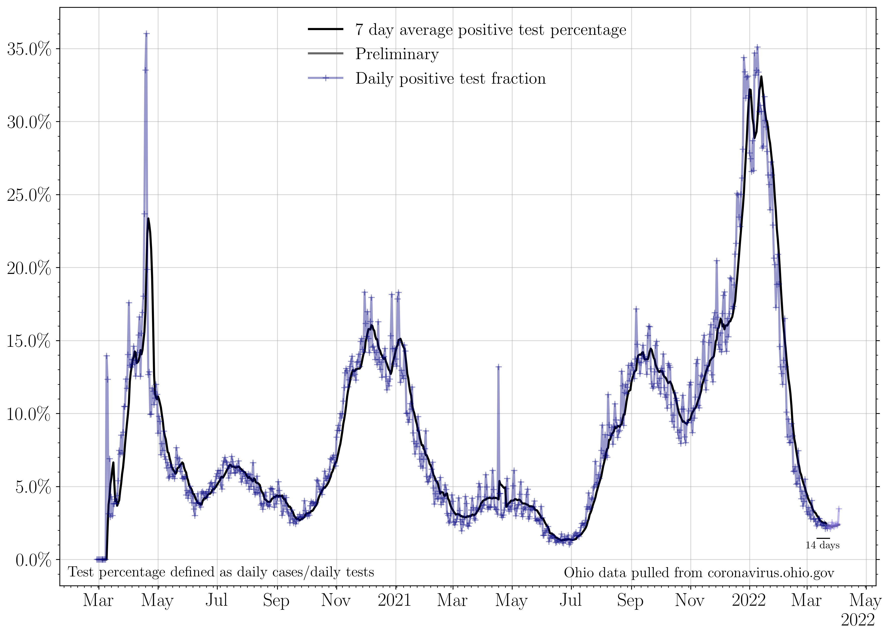

## Plotting publicly available COVID data for the state of Ohio. 

Last updated: Aug 31 2020. 

### 7 day averages
The 7 day averages for the daily increase in cases, hospitalizations, ICU admissions, and deaths. If no new cases were reported, these lines would go to zero.

>The average increase in cases for the last seven days is: 1072.0
>
>The last time cases per day were this high was Aug 15 2020: 16 days ago.
>
>The seven day average then was: 1101 cases.

>
>The last time cases per day was lower than this was Aug 30 2020: 1 day ago.
>
>The seven day average then was: 1066 cases.
>
>The lowest 7 day average reported cases per day in the last three weeks was on Aug 21 2020.
>
>This was 10 days ago. The average was 927 cases per day.
>
>The current 7 day average case rate is an increase of 15.6 percent with respect to that minimum.

The 7 day averages for the daily increase in hospitalizations, ICU admissions, and deaths. If no new events were reported, these lines would go to zero.

>The average increase in hospitalizations per day for the last seven days is: 74
>
>The lowest 7 day average reported hospitalizations per day in the last three weeks was on Aug 28 2020.
>
>This was 3 days ago. The average was 72 hospitalizations per day.
>
>The current 7 day average hospitalization rate is an increase of 2.8 percent with respect to then.

### Raw data
The raw daily increase in cases, hospitalizations, ICU admissions, and deaths. The 7 day average is shown faintly behind the raw data. If no new cases were reported, this line would go to zero.

>The increase in cases from yesterday to today: 895.0 
>
>The last time cases per day were this high was Aug 30 2020: 1 day ago. 
>
>The case rate then was 922 cases.
>
>The last time cases per day were lower than this was Aug 25 2020: 6 days ago. 
>
>The case rate then was 844 cases.

The raw daily increase in hospitalizations, ICU admissions, and deaths. The 7 day average is shown faintly behind the raw data. If no new events were reported, these lines would go to zero.

### Testing

The increase in the number of reported total tests (navy). A 7 day running average is shown in black.

The percent of each day's new reported tests which represent that day's new reported cases.

>Today marks the lowest 7 day average positivity fraction in the last three weeks, at 3.1 percent.

### Cumulative plots
The cumulative number of cases, hospitalizations, ICU admissions, and deaths. If no new cases were reported, these lines would be horizontal.

>The current total number of cases is equivalent to 1 person out of every 94 people in the state of Ohio having tested positive for COVID-19.

The cumulative number of hospitalizations, ICU admissions, and deaths. If no new events were reported, these lines would be horizontal.

