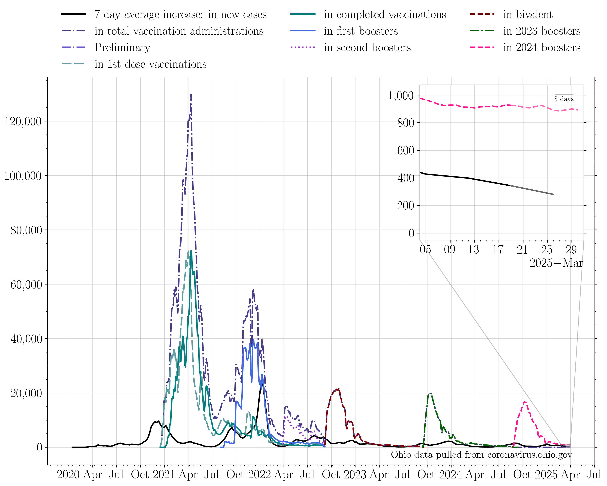

## Plotting publicly available COVID data for the state of Ohio. 

Last updated: Dec 28 2020. 

**Dec 8th completes a backlog of reporting of antigen test results, dating back to Nov 1st.**

**No data was reported on Nov 26th (Thanksgiving) or Dec 25th (Christmas).**
### 7 day averages
The 7 day averages for the daily increase in cases, hospitalizations, ICU admissions, and deaths. If no new cases were reported, these lines would go to zero.

>The average increase in cases for the last seven days is: 6527.0
>
>The last time cases per day were this high was Dec 27 2020: 1 day ago.
>
>The seven day average then was: 6817 cases.

>
>The last time cases per day was lower than this was Nov 14 2020: 44 days ago.
>
>The seven day average then was: 6359 cases.
>
>Today marks the lowest 7 day average in the last three weeks.

The 7 day averages for the daily increase in hospitalizations, ICU admissions, and deaths. If no new events were reported, these lines would go to zero.

>The average increase in hospitalizations per day for the last seven days is: 290
>
>The lowest 7 day average reported hospitalizations per day in the last three weeks was on Dec 26 2020.
>
>This was 2 days ago. The average was 280 hospitalizations per day.
>
>The current 7 day average hospitalization rate is an increase of 3.6 percent with respect to then.

The 7 day average increase in cases, compared to the number of first round vaccinations dispensed:

### Raw data
The raw daily increase in cases, hospitalizations, ICU admissions, and deaths. The 7 day average is shown faintly behind the raw data. If no new cases were reported, this line would go to zero.

>The increase in cases from yesterday to today: 4519.0 
>
>The last time cases per day were this high was Dec 27 2020: 1 day ago. 
>
>The case rate then was 5857 cases.
>
>The last time cases per day were lower than this was Dec 25 2020: 3 days ago. 
>
>The case rate then was 0 cases.

The raw daily increase in hospitalizations, ICU admissions, and deaths. The 7 day average is shown faintly behind the raw data. If no new events were reported, these lines would go to zero.

### Testing

The increase in the number of reported total tests (navy). A 7 day running average is shown in black.

The percent of each day's new reported tests which represent that day's new reported cases.

>Today marks the lowest 7 day average positivity fraction in the last three weeks, at 15.1 percent.

### Cumulative plots
The cumulative number of cases, hospitalizations, ICU admissions, and deaths. If no new cases were reported, these lines would be horizontal.

>The current total number of cases is equivalent to 1 person out of every 17 people in the state of Ohio having tested positive for COVID-19.

The cumulative number of hospitalizations, ICU admissions, and deaths. If no new events were reported, these lines would be horizontal.

The cumulative number of first round vaccinations. If no new events were reported, these lines would be horizontal.

