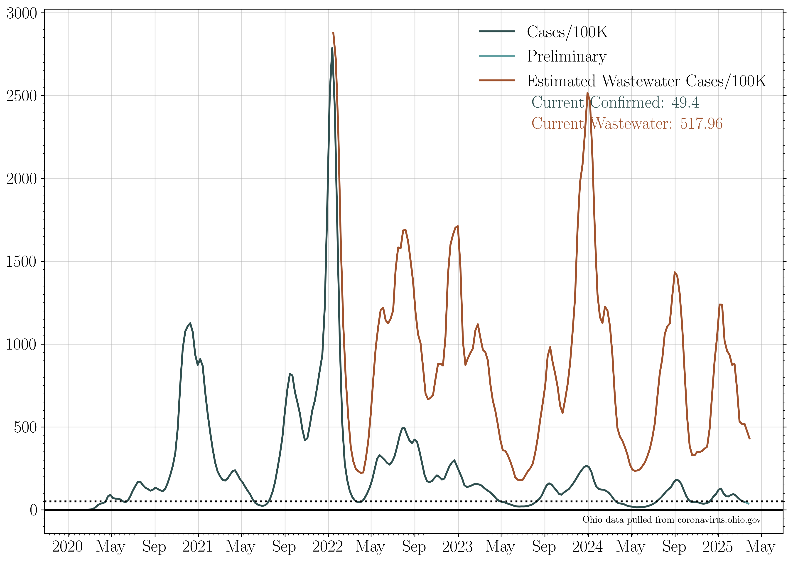

## Plotting publicly available COVID data for the state of Ohio. 

Most recent data: Jun 21 2023. 

#### Data source
These plots are made using the summary data posted by the state of Ohio for the new case rate,
    new hospitalization, and new death plots. The three most recent dates are omitted, as the data is very incomplete. Values for the most recent two weeks may change, and are flagged by a paler tone color in the plots below. 

Ohio has transitioned to updating its dashboards once a week, on Thursdays. Data can only be posted on Thursdays as a result. 

*The Ohio Department of Health is no longer updating testing data, as of April 4th, 2022. Testing and testing positivity plots can no longer be updated.* 

### 7 day averages
The 7 day averages for the daily increase in cases. If no new cases were reported, these lines would go to zero.

>The average increase in reported cases for the seven days ending on Jun 18 is: 153.0
>
>The last time cases per day were this high was Jun 16 2023: 2 days prior.
>
>The seven day average then was: 157 cases.

>
>The last time cases per day was lower than this was Jun 17 2023: 1 day prior.
>
>The seven day average then was: 151 cases.
>
>The lowest 7 day average reported cases per day in the last three weeks was on Jun 11 2023.
>
>This was 7 days prior. The average was 149 cases per day.
>
>The 7 day average case rate on Jun 18 is an increase of 2.7 percent with respect to that minimum.

The 7 day averages for the daily increase in hospitalizations and deaths. If no new events were reported, these lines would go to zero.

>The average increase in hospitalizations per day for the seven days ending on Jun 18 is: 5
>
>Jun 18 marks the lowest 7 day average in hospitalizations in the last three weeks.

The 7 day average increase in cases, compared to the rate of first round vaccinations, second round vaccinations, and total number of vaccinations dispensed:

### Raw data
The raw daily increase in cases, hospitalizations, and deaths. The 7 day average is shown faintly behind the raw data. If no new cases were reported, this line would go to zero.

>The provisional increase in cases from Jun 17 to Jun 18: 131.0 
>
>The last time cases per day were this high was Jun 16 2023: 2 days prior. 
>
>The case rate then was 157 cases.
>
>The last time cases per day were lower than this was Jun 17 2023: 1 day prior. 
>
>The case rate then was 82 cases.

The raw daily increase in hospitalizations, ICU admissions, and deaths. The 7 day average is shown faintly behind the raw data. If no new events were reported, these lines would go to zero.

### Case rates/100K 

The number of positive cases per 100,000 people in the state of Ohio (gray). This is an estimate based on the number of cases reported with onsets within the last two weeks, per 100K people.

### Cumulative plots
The cumulative number of cases, hospitalizations, ICU admissions, and deaths. If no new cases were reported, these lines would be horizontal.

>The current total number of cases is equivalent to 5 people out of every 17 people in the state of Ohio having tested positive for COVID-19.

The cumulative number of hospitalizations, ICU admissions, and deaths. If no new events were reported, these lines would be horizontal.

The cumulative number of first and second round vaccinations. If no new events were reported, these lines would be horizontal.

>The current total number of first round vaccinations represents to 13 people out of every 20 in the state of Ohio having begun their vaccination sequence.
>This is 64.94 percent of the population of Ohio.

>Currently fully vaccinated (2 weeks past a second dose) are: 7,040,169 people, who received their second round vaccination on or before Jun 14 2023.
>This represents 60.17 percent of the population of Ohio.

>Currently up to date with bivalent boosters are: 1,891,373 people, who received their second booster dose on or before Jun 14 2023.
>This represents 16.17 percent of the population of Ohio.

### Archival: Testing
**These figures cannot be updated as Ohio Dept. of Health is no longer reporting testing data.**

The increase in the number of reported total tests (navy), ending April 4th, 2022. A 7 day running average is shown in black.

The percent of each day's new reported tests which represent that day's new reported cases. Data ended on April 4th, 2022.

