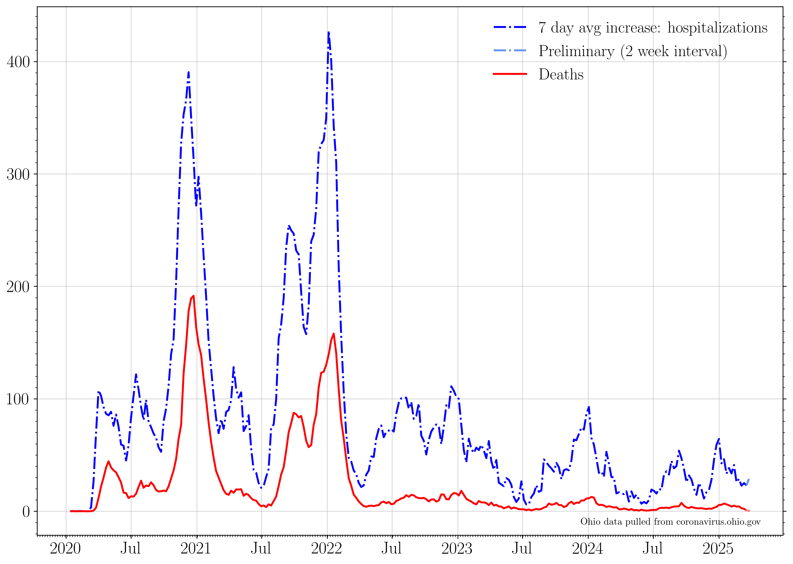

## Plotting publicly available COVID data for the state of Ohio. 

Last updated: Mar 02 2021. 

**As of March 02, death data is only reported 2x/week, and includes only confirmed cases. March 02 cumulative death counts have dropped due to the missing "probable" cases.**

Feb 11th-28th involved a "reconciling" of death data for November & December.

Dec 8th completed a backlog of reporting of antigen test results, dating back to Nov 1st.

No data was reported on Nov 26th (Thanksgiving), Dec 25th (Christmas), or Jan 1st (New Year's).
### 7 day averages
The 7 day averages for the daily increase in cases, hospitalizations, ICU admissions, and deaths. If no new cases were reported, these lines would go to zero.

>The average increase in cases for the last seven days is: 1776.0
>
>The last time cases per day were this high was Mar 01 2021: 1 day ago.
>
>The seven day average then was: 1928 cases.

>
>The last time cases per day was lower than this was Oct 16 2020: 137 days ago.
>
>The seven day average then was: 1698 cases.
>
>Today marks the lowest 7 day average in the last three weeks.

The 7 day averages for the daily increase in hospitalizations, ICU admissions, and deaths. If no new events were reported, these lines would go to zero.

>The average increase in hospitalizations per day for the last seven days is: 122
>
>The lowest 7 day average reported hospitalizations per day in the last three weeks was on Feb 18 2021.
>
>This was 12 days ago. The average was 113 hospitalizations per day.
>
>The current 7 day average hospitalization rate is an increase of 8.0 percent with respect to then.

The 7 day average increase in cases, compared to the rate of first round vaccinations, second round vaccinations, and total number of vaccinations dispensed:

### Raw data
The raw daily increase in cases, hospitalizations, ICU admissions, and deaths. The 7 day average is shown faintly behind the raw data. If no new cases were reported, this line would go to zero.

>The increase in cases from yesterday to today: 1709.0 
>
>The last time cases per day were this high was Feb 27 2021: 3 days ago. 
>
>The case rate then was 1774 cases.
>
>The last time cases per day were lower than this was Mar 01 2021: 1 day ago. 
>
>The case rate then was 1452 cases.

The raw daily increase in hospitalizations, ICU admissions, and deaths. The 7 day average is shown faintly behind the raw data. If no new events were reported, these lines would go to zero.

### Testing

The increase in the number of reported total tests (navy). A 7 day running average is shown in black.

The percent of each day's new reported tests which represent that day's new reported cases.

>Today marks the lowest 7 day average positivity fraction in the last three weeks, at 4.9 percent.

### Cumulative plots
The cumulative number of cases, hospitalizations, ICU admissions, and deaths. If no new cases were reported, these lines would be horizontal.

>The current total number of cases is equivalent to 1 person out of every 12 people in the state of Ohio having tested positive for COVID-19.

The cumulative number of hospitalizations, ICU admissions, and deaths. If no new events were reported, these lines would be horizontal.

The cumulative number of first and second round vaccinations. If no new events were reported, these lines would be horizontal.

>The current total number of first round vaccinations is equivalent to 3 people out of every 20 in the state of Ohio having begun their vaccination sequence, or 3 people out of every 16 people over age 18.
 >This is 14.76 percent of the population of Ohio, and 18.95 percent of the 18+ population.

>The current total number of second round vaccinations is equivalent to 2 people out of every 25 in the state of Ohio having completed their vaccination sequence, or 2 people out of every 19 people over age 18. 
>This is 8.03 percent of the population of Ohio, and 10.31 percent of the 18+ population.

>Currently fully protected by the vaccine are: 494754 people, who received their second round vaccination on or before Feb 16 2021.
>This represents 4.23 percent of the population of Ohio, or 5.43 percent of the 18+ population.

