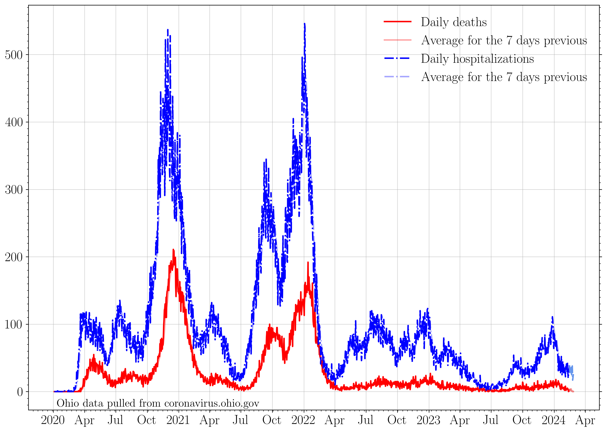

## Plotting publicly available COVID data for the state of Ohio. 

Most recent data: Apr 07 2022. 

#### Data source
These plots are made using the summary data posted by the state of Ohio for the new case rate,
    new hospitalization, and new death plots. The three most recent dates are omitted, as the data is very incomplete. Values for the most recent two weeks may change, and are flagged by a paler tone color in the plots below. 

*Ohio has transitioned to updating its dashboards once a week, on Thursdays. Data can only be posted on Thursdays as a result.* 

### 7 day averages
The 7 day averages for the daily increase in cases. If no new cases were reported, these lines would go to zero.

>The average increase in reported cases for the seven days ending on Apr 04 is: 364.0
>
>The last time cases per day were this high was Mar 27 2022: 8 days prior.
>
>The seven day average then was: 364 cases.

>
>The last time cases per day was lower than this was Apr 03 2022: 1 day prior.
>
>The seven day average then was: 357 cases.
>
>The lowest 7 day average reported cases per day in the last three weeks was on Mar 31 2022.
>
>This was 4 days prior. The average was 351 cases per day.
>
>The 7 day average case rate on Apr 04 is an increase of 3.7 percent with respect to that minimum.

The 7 day averages for the daily increase in hospitalizations and deaths. If no new events were reported, these lines would go to zero.

>The average increase in hospitalizations per day for the seven days ending on Apr 04 is: 14
>
>Apr 04 marks the lowest 7 day average in hospitalizations in the last three weeks.

The 7 day average increase in cases, compared to the rate of first round vaccinations, second round vaccinations, and total number of vaccinations dispensed:

### Raw data
The raw daily increase in cases, hospitalizations, and deaths. The 7 day average is shown faintly behind the raw data. If no new cases were reported, this line would go to zero.

>The provisional increase in cases from Apr 03 to Apr 04: 453.0 
>
>The last time cases per day were this high was Mar 21 2022: 14 days prior. 
>
>The case rate then was 481 cases.
>
>The last time cases per day were lower than this was Apr 03 2022: 1 day prior. 
>
>The case rate then was 264 cases.

The raw daily increase in hospitalizations, ICU admissions, and deaths. The 7 day average is shown faintly behind the raw data. If no new events were reported, these lines would go to zero.

### Case rates/100K 

The number of positive cases per 100,000 people in the state of Ohio (gray). This is an estimate based on the number of cases reported with onsets within the last two weeks, per 100K people.

### Testing

The increase in the number of reported total tests (navy). A 7 day running average is shown in black.

The percent of each day's new reported tests which represent that day's new reported cases.

>The lowest 7 day average reported positive test fraction per day in the last three weeks was on Mar 27 2022.
>
>This was 7 days prior. The average was 2.2 percent positive. 
>
>The current average positive test rate is 2.4 percent, a change of 9.1 percent with respect to then. 

### Cumulative plots
The cumulative number of cases, hospitalizations, ICU admissions, and deaths. If no new cases were reported, these lines would be horizontal.

>The current total number of cases is equivalent to 5 people out of every 22 people in the state of Ohio having tested positive for COVID-19.

The cumulative number of hospitalizations, ICU admissions, and deaths. If no new events were reported, these lines would be horizontal.

The cumulative number of first and second round vaccinations. If no new events were reported, these lines would be horizontal.

>The current total number of first round vaccinations represents to 5 people out of every 8 in the state of Ohio having begun their vaccination sequence.
>This is 62.34 percent of the population of Ohio.

>The current total number of second round vaccinations represents 26 people out of every 45 in the state of Ohio having completed their vaccination sequence.
>This is 57.78 percent of the population of Ohio.

>Currently fully vaccinated (2 weeks past a second dose) are: 6,741,002 people, who received their second round vaccination on or before Mar 30 2022.
>This represents 57.62 percent of the population of Ohio.

>Currently maximally protected are: 3,475,886 people, who received their third vaccination dose on or before Mar 30 2022.
>This represents 29.71 percent of the population of Ohio.

