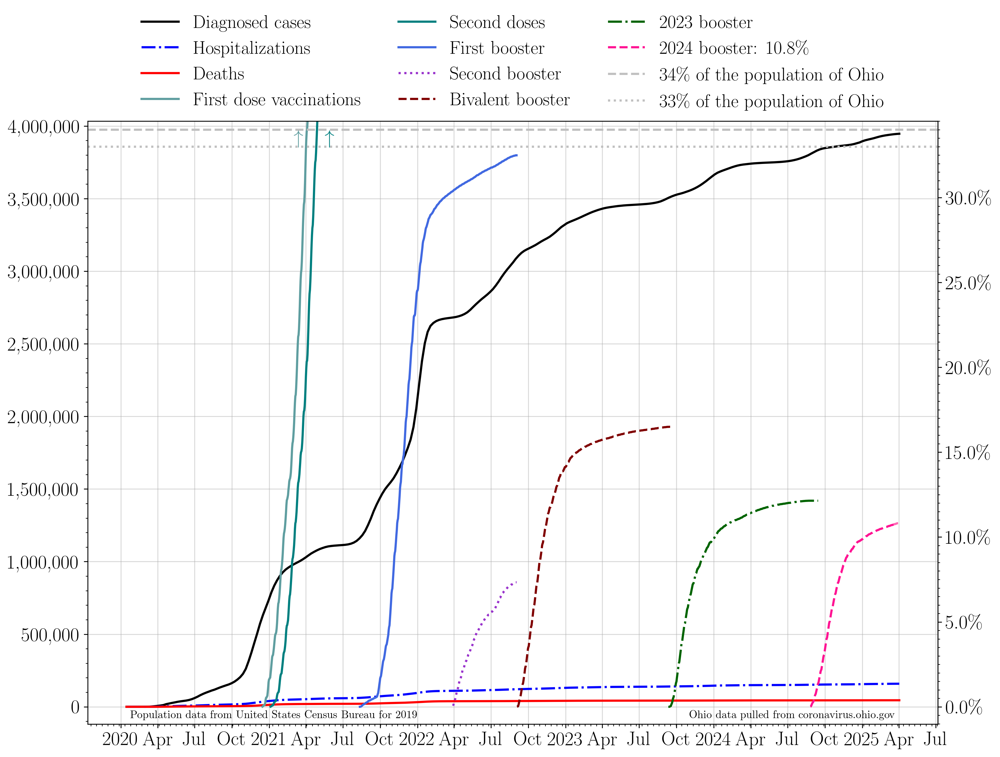

## Plotting publicly available COVID data for the state of Ohio. 

Last updated: Aug 08 2020. 

### 7 day averages
The 7 day averages for the daily increase in cases, hospitalizations, ICU admissions, and deaths. If no new cases were reported, these lines would go to zero.

>The average increase in cases for the last seven days is: 1126.0
>
>The last time cases per day were this high was Aug 05 2020: 3 days ago.
>
>The seven day average then was: 1201 cases.

>
>The last time cases per day was lower than this was Aug 07 2020: 1 day ago.
>
>The seven day average then was: 1073 cases.
>
>The lowest 7 day average reported cases per day in the last three weeks was on Aug 07 2020.
>
>This was 1 days ago. The average was 1074 cases per day.
>
>The current 7 day average case rate is an increase of 4.8 percent with respect to that minimum.
The 7 day averages for the daily increase in hospitalizations, ICU admissions, and deaths. If no new events were reported, these lines would go to zero.

>The average increase in hospitalizations per day for the last seven days is: 94.0
>
>The lowest 7 day average reported hospitalizations per day in the last three weeks was on Jul 24 2020.
>
>This was 15 days ago. The average was 90.0 hospitalizations per day.
>
>The current 7 day average hospitalization rate is an increase of 4.4 percent with respect to then.

### Raw data
The raw daily increase in cases, hospitalizations, ICU admissions, and deaths. The 7 day average is shown faintly behind the raw data. If no new cases were reported, this line would go to zero.

>The increase in cases from yesterday to today: 1294.0 
>
>The last time cases per day were this high was Jul 31 2020: 8 days ago. 
>
>The case rate then was 1533 cases.
>
>The last time cases per day were lower than this was Aug 07 2020: 1 day ago. 
>
>The case rate then was 1204 cases.

The raw daily increase in hospitalizations, ICU admissions, and deaths. The 7 day average is shown faintly behind the raw data. If no new events were reported, these lines would go to zero.

### Testing

The increase in the number of reported total tests (navy). A 7 day running average is shown in black.

The percent of each day's new reported tests which represent that day's new reported cases.

>The lowest 7 day average reported positive test fraction per day in the last three weeks was on Aug 01 2020.
>
>This was 7 days ago. The average was 4.5 percent positive. 
>
>The current average positive test rate is 5.2 percent, a change of 15.6 percent with respect to then. 

### Cumulative plots
The cumulative number of cases, hospitalizations, ICU admissions, and deaths. If no new cases were reported, these lines would be horizontal.

The cumulative number of hospitalizations, ICU admissions, and deaths. If no new events were reported, these lines would be horizontal.

