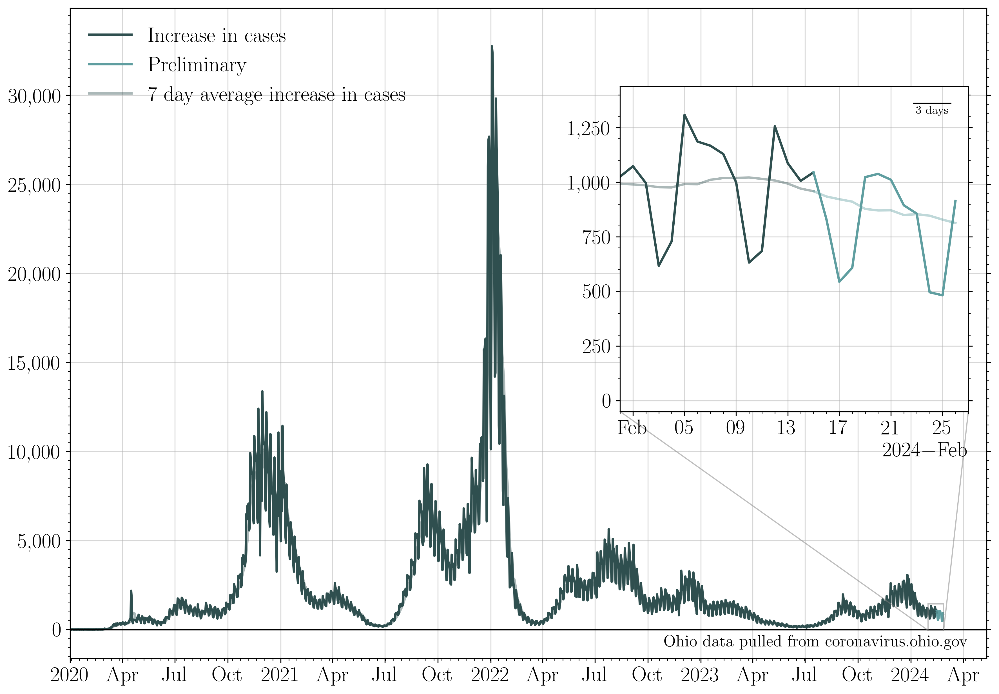

## Plotting publicly available COVID data for the state of Ohio. 

Most recent data: Dec 31 2021. 

As of March 02 2021, death data is only reported 2x/week, and includes only confirmed cases. March 02 2021 cumulative death counts have dropped due to the missing "probable" cases.

Feb 11th-28th 2021 involved a "reconciling" of death data for November & December.

Dec 8th completed a backlog of reporting of antigen test results, dating back to Nov 1st.

No data was reported on Nov 26th 2020 (Thanksgiving), Dec 25th 2020 (Christmas), Jan 1st 2021 (New Year's), Apr 4th 2021 (Easter), July 4th 2021, Nov 25th 2021 (Thanksgiving), or Dec 25th 2021 (Christmas).
### 7 day averages
The 7 day averages for the daily increase in cases. If no new cases were reported, these lines would go to zero.

>The average increase in reported cases for the last seven days is: 15015.0
>
>This is the highest the 7 day average increase in cases has ever been.
>
>The last time cases per day was lower than this was Dec 30 2021: 1 day ago.
>
>The seven day average then was: 14131 cases.
>
>The lowest 7 day average reported cases per day in the last three weeks was on Dec 12 2021.
>
>This was 19 days ago. The average was 7201 cases per day.
>
>The current 7 day average case rate is an increase of 108.5 percent with respect to that minimum.

The 7 day averages for the daily increase in hospitalizations, ICU admissions, and deaths. If no new events were reported, these lines would go to zero.

>The average increase in hospitalizations per day for the last seven days is: 300
>
>The lowest 7 day average reported hospitalizations per day in the last three weeks was on Dec 28 2021.
>
>This was 3 days ago. The average was 259 hospitalizations per day.
>
>The current 7 day average hospitalization rate is an increase of 15.8 percent with respect to then.

The 7 day average increase in cases, compared to the rate of first round vaccinations, second round vaccinations, and total number of vaccinations dispensed:

### Raw data
The raw daily increase in cases, hospitalizations, ICU admissions, and deaths. The 7 day average is shown faintly behind the raw data. If no new cases were reported, this line would go to zero.

>The increase in cases from yesterday to today: 20598.0 
>
>The last time cases per day were this high was Dec 26 2021: 5 days ago. 
>
>The case rate then was 20917 cases.
>
>The last time cases per day were lower than this was Dec 30 2021: 1 day ago. 
>
>The case rate then was 19774 cases.

The raw daily increase in hospitalizations, ICU admissions, and deaths. The 7 day average is shown faintly behind the raw data. If no new events were reported, these lines would go to zero.

### Case rates/100K 

The number of positive cases per 100,000 people in the state of Ohio (gray). This is an estimate based on the number of cases reported with onsets within the last two weeks, per 100K people.

### Testing

The increase in the number of reported total tests (navy). A 7 day running average is shown in black.

The percent of each day's new reported tests which represent that day's new reported cases.

>The lowest 7 day average reported positive test fraction per day in the last three weeks was on Dec 11 2021.
>
>This was 20 days ago. The average was 18.8 percent positive. 
>
>The current average positive test rate is 43.5 percent, a change of 131.4 percent with respect to then. 

### Cumulative plots
The cumulative number of cases, hospitalizations, ICU admissions, and deaths. If no new cases were reported, these lines would be horizontal.

>The current total number of cases is equivalent to 4 people out of every 23 people in the state of Ohio having tested positive for COVID-19.

The cumulative number of hospitalizations, ICU admissions, and deaths. If no new events were reported, these lines would be horizontal.

The cumulative number of first and second round vaccinations. If no new events were reported, these lines would be horizontal.

>The current total number of first round vaccinations represents to 3 people out of every 5 in the state of Ohio having begun their vaccination sequence, and 7 people out of every 10 people over age 18.
 >This is 59.85 percent of the population of Ohio, and 70.13 percent of the 18+ population.

>The current total number of second round vaccinations represents 27 people out of every 49 in the state of Ohio having completed their vaccination sequence, and 13 people out of every 20 people over age 18. 
>This is 55.07 percent of the population of Ohio, and 65.08 percent of the 18+ population.

>Currently fully vaccinated (2 weeks past a second dose) are: 6,359,979 people, who received their second round vaccination on or before Dec 24 2021.
>This represents 54.36 percent of the population of Ohio, and 64.52 percent of adults over 18.

>Currently maximally protected are: 2,462,528 people, who received their third vaccination dose on or before Dec 24 2021.
>This represents 21.05 percent of the population of Ohio, and 27.02 percent of adults over 18.

