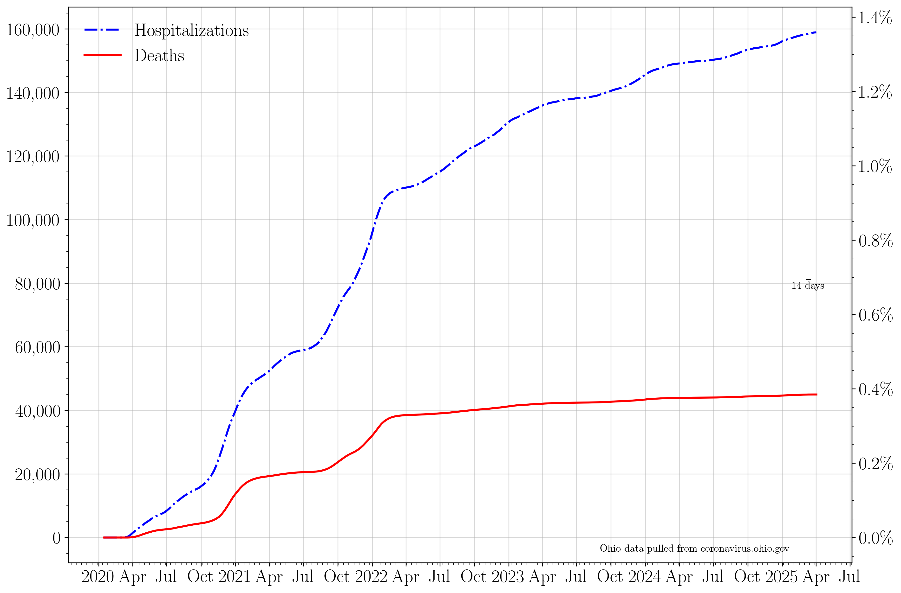

## Plotting publicly available COVID data for the state of Ohio. 

Last updated: Sep 22 2020. 

### 7 day averages
The 7 day averages for the daily increase in cases, hospitalizations, ICU admissions, and deaths. If no new cases were reported, these lines would go to zero.

>The average increase in cases for the last seven days is: 909.0
>
>The last time cases per day were this high was Sep 21 2020: 1 day ago.
>
>The seven day average then was: 954 cases.

>
>The last time cases per day was lower than this was Jul 01 2020: 83 days ago.
>
>The seven day average then was: 872 cases.
>
>Today marks the lowest 7 day average in the last three weeks.

The 7 day averages for the daily increase in hospitalizations, ICU admissions, and deaths. If no new events were reported, these lines would go to zero.

>The average increase in hospitalizations per day for the last seven days is: 60
>
>Today marks the lowest 7 day average in hospitalizations in the last three weeks.

### Raw data
The raw daily increase in cases, hospitalizations, ICU admissions, and deaths. The 7 day average is shown faintly behind the raw data. If no new cases were reported, this line would go to zero.

>The increase in cases from yesterday to today: 685.0 
>
>The last time cases per day were this high was Sep 21 2020: 1 day ago. 
>
>The case rate then was 856 cases.
>
>The last time cases per day were lower than this was Sep 08 2020: 14 days ago. 
>
>The case rate then was 656 cases.

The raw daily increase in hospitalizations, ICU admissions, and deaths. The 7 day average is shown faintly behind the raw data. If no new events were reported, these lines would go to zero.

### Testing
**The cumulative number of tests reported for September 22 is the same as for September 21st.**

The increase in the number of reported total tests (navy). A 7 day running average is shown in black.

The percent of each day's new reported tests which represent that day's new reported cases.

>The lowest 7 day average reported positive test fraction per day in the last three weeks was on Sep 21 2020.
>
>This was 1 days ago. The average was 2.9 percent positive. 
>
>The current average positive test rate is 3.2 percent, a change of 10.3 percent with respect to then. 

### Cumulative plots
The cumulative number of cases, hospitalizations, ICU admissions, and deaths. If no new cases were reported, these lines would be horizontal.

>The current total number of cases is equivalent to 1 person out of every 80 people in the state of Ohio having tested positive for COVID-19.

The cumulative number of hospitalizations, ICU admissions, and deaths. If no new events were reported, these lines would be horizontal.

